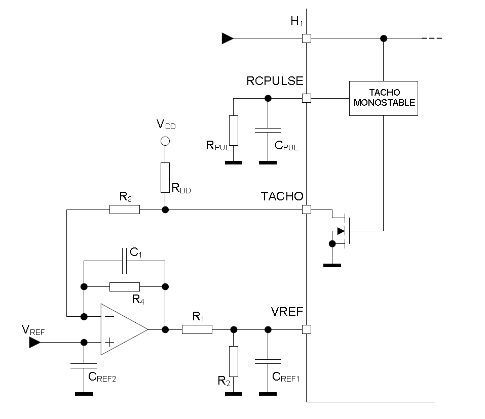
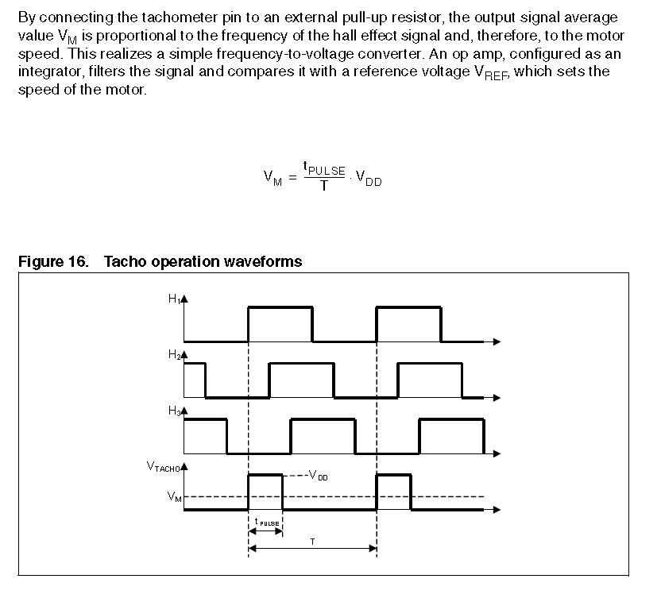
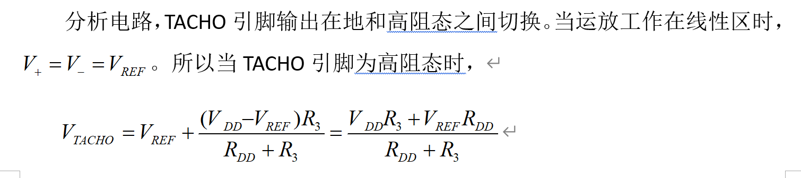
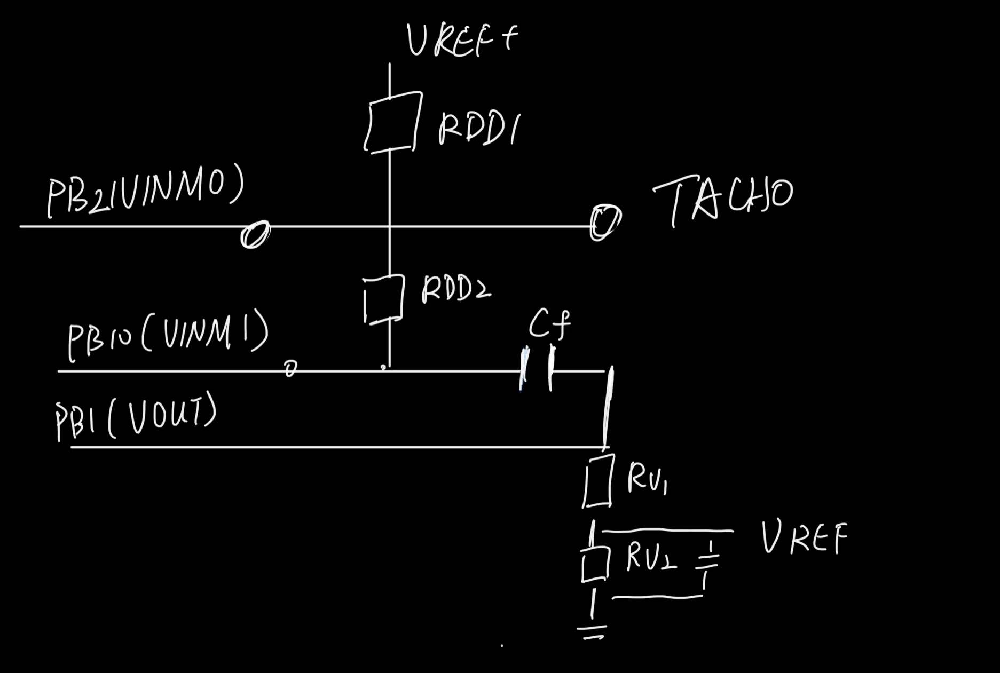
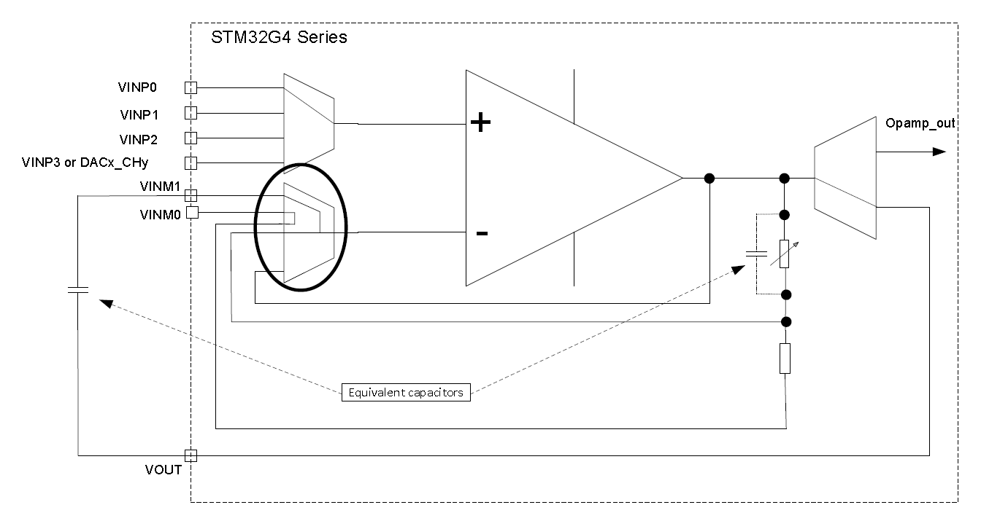
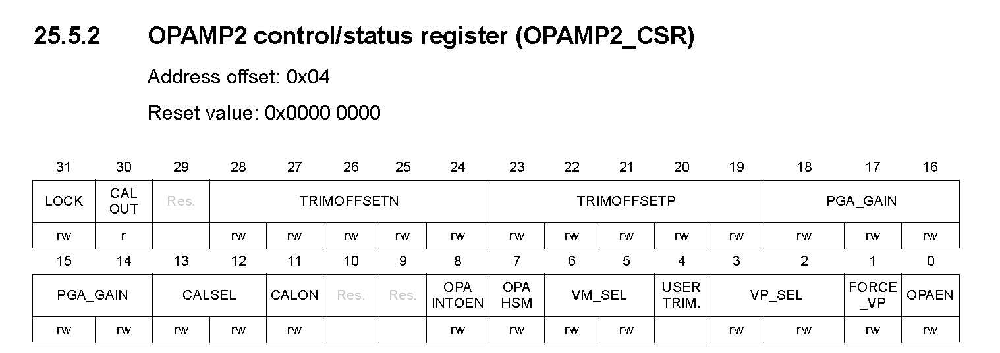
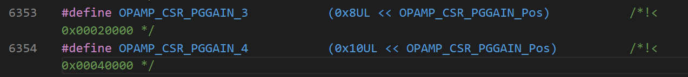
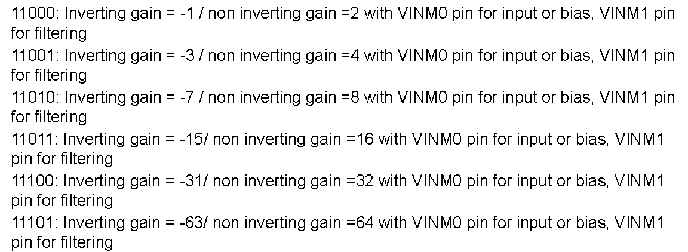

要实现的电路为：

- [x] $V_{TACHO}$该点随时间平均后究竟是多少？

冲突为，当TACHO引脚在高阻态时，$V_{TACHO}$是多少？

TACHO引脚为 open drain output pin，当控制输出为高电平时，实际表现为高阻态，控制输出为低电平时，控制输出低电平引脚接地。高阻态表现可做开路理解，所以是datasheet里面进行了简略。

- [ ] 配置解释？

共分五部分：

- PGA or Follower or Standalone
- connected or not

是否有VINM0

- IO0 or not

是否有VINP

- IO1 or not

是否有VINM1

- DAC3_OUT1 or not 

是否有VINP

 存疑，对照寄存器值确认。

目前的代码配置与设计一致。
