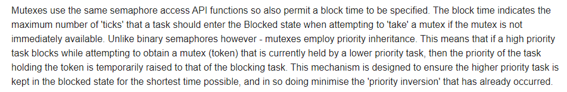
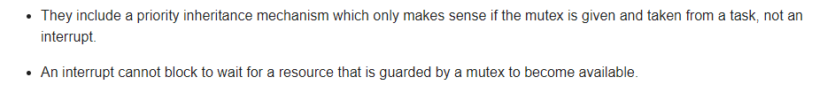
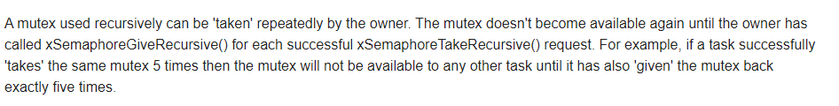
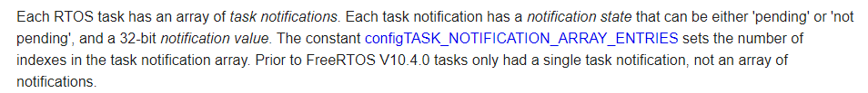
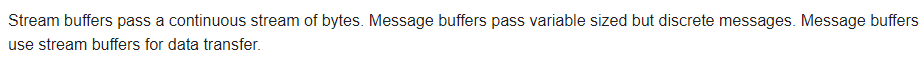

https://www.freertos.org/features.html

[toc]

## tasks 

### task states


### task priorities

The idle task has priority zero.


### task 生命周期的API

```c
Tasks are created by calling xTaskCreate() or xTaskCreateStatic(), and deleted by calling vTaskDelete().
```

## task 之间的通讯

### queues 

- 传值
- 通过传递指针同样可以实现传指针**（多个tasks 共享一个内存空间）**
- 由内核负责queue的存储空间分配
- 在中断中使用的api不同于task中
- 对queue 的操作如果不合法，会导致当前的task blocked

<u>**Note that interrupts must NOT use API functions that do not end in "FromISR".**</u>

### Binary Semaphores  VS Counting Semaphores VS  Mutexes

counting semaphores 和 binary ... 基本一致，但在电机转动过程中，适宜使用counting semaphores

Mutexes are binary semaphores that include a priority inheritance mechanism.

#### what is the inheritance mechanism



<u>**mutex should not be used in an interrupt!!**</u>





## task notification



较上述几个信号量使用起来更轻量化，没有从文档中读出原因，还有待编程进一步体验。

## Stream & Message Buffers



只能由一个task 读，一个task写。

```c
If there are to be multiple different writers then the application writer must place each call to a writing API function (such as xStreamBufferSend()) inside a critical section and use a send block time of 0.
```


