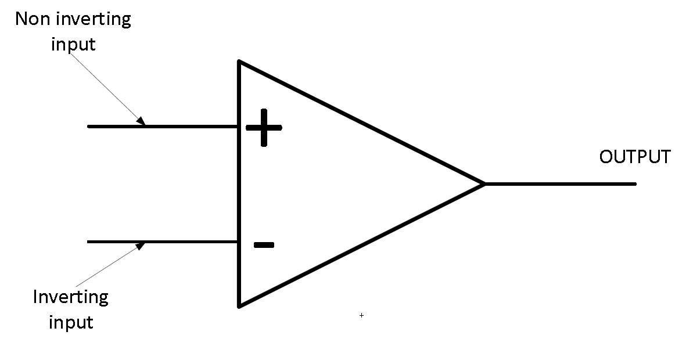
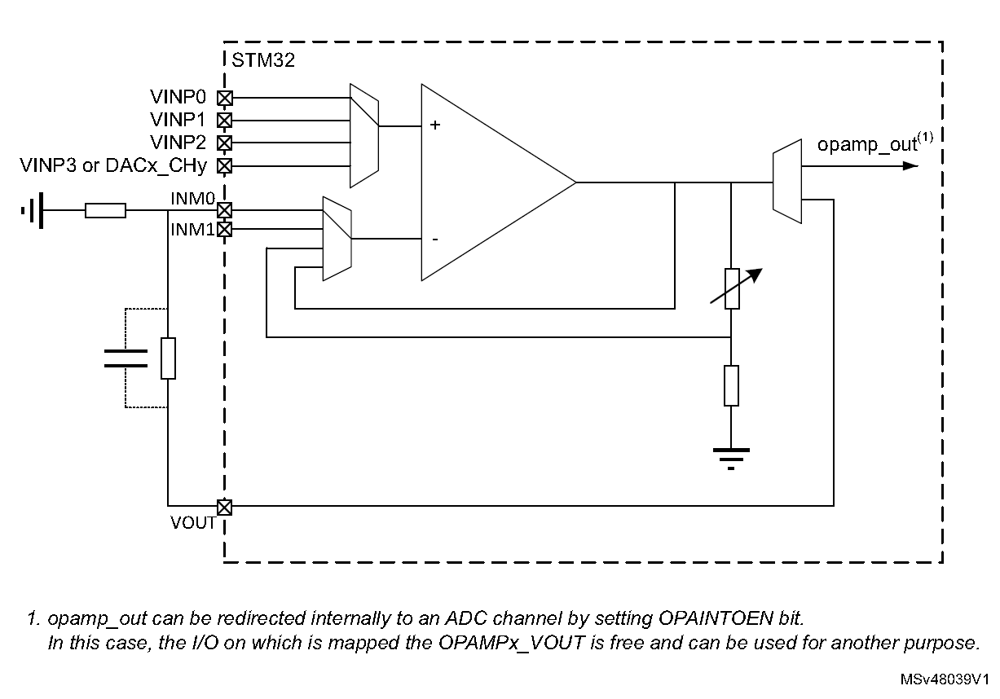
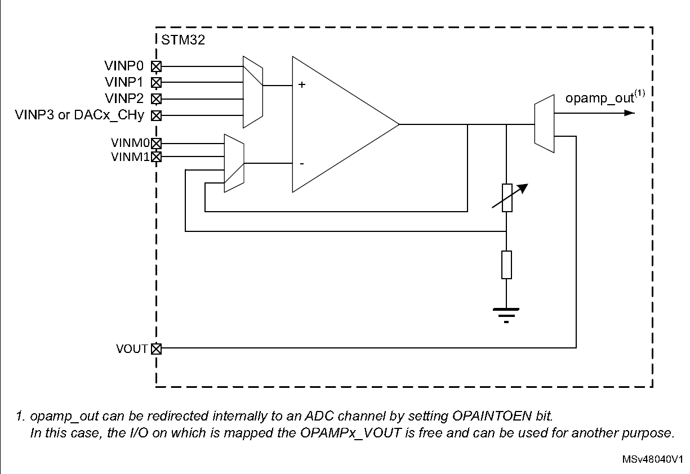
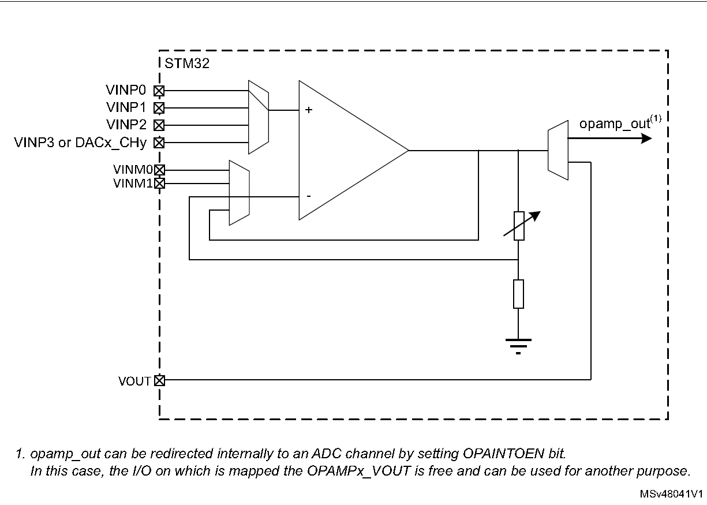

## STM32G431RBT6

选择该款芯片主要是因为其内置了运算放大器。

## DAC

Question: 多久可以改变一次数值，响应时间有多少


操作首先要经过buffer DAC_DORx，什么是hardware trigger 以及哪里确定$t_{SETTLING}$ 


什么是DAC output buffer？


## TIM 

> 需要利用计时器获得较1000hz更高频率的时间戳。

寄存器定义：

``` c++
typedef volatile unsigned short vu16;
typedef unsigned short u16;
typedef struct
{
  vu16 CR1;
  u16 RESERVED0;
  vu16 CR2;
  u16 RESERVED1;
  vu16 SMCR;
  u16 RESERVED2;
  vu16 DIER;
  u16 RESERVED3;
  vu16 SR;
  u16 RESERVED4;
  vu16 EGR;
  u16 RESERVED5;
  vu16 CCMR1;
  u16 RESERVED6;
  vu16 CCMR2;
  u16 RESERVED7;
  vu16 CCER;
  u16 RESERVED8;
  vu16 CNT;
  u16 RESERVED9;
  vu16 PSC;
  u16 RESERVED10;
  vu16 ARR;
  u16 RESERVED11[3];
  vu16 CCR1;
  u16 RESERVED12;
  vu16 CCR2;
  u16 RESERVED13;
  vu16 CCR3;
  u16 RESERVED14;
  vu16 CCR4;
  u16 RESERVED15[3];
  vu16 DCR;
  u16 RESERVED16;
  vu16 DMAR;
  u16 RESERVED17;
} TIM_TypeDef;
// volatile 关键字， 禁止编译器对该变量进行优化，该变量被多进程访问，有可能做出改变
```

- [ ] 定时器分为高级控制定时器，通用定时器及基本定时器三种，需要区分。

### 基本定时器：TIM6，TIM7

时基单元：

- 计数器寄存器（TIMx_CNT）
- 预分频寄存器（TIMx_PSC），从输入时钟到TIMx_CNT的转换倍率。
- 自动重装载寄存器（TIMx_ARR），此为TIMx_CNT上界，没看懂ARPE的作用，

调试模式下，计数器有可能被设置为不工作，需要注意 DBG_TIMx_STOP。

## OPAMP



理想OPAMP含有一下几个特点：

- Infinite Amplification Gain (open loop)

集成运放输出端与输入端之间没有外接元件（无反馈）时，在输入端加入小电压信号时所测出的电压放大倍数。理想运放的开环电压放大倍数为无穷大。

- Infinite Input Impedance 

集成运放的输入电压与输入电流的比值，一般很高，为几千欧以上。

- Zero Output Impedance 

The output impedance of the ideal operational amplifier is assumed to be zero acting as a perfect internal voltage source with no internal resistance so that it can supply as much current as necessary to the load. This internal resistance is effectively in series with the load thereby reducing the output voltage available to the load. Real op-amps have output impedances in the 100-20kΩ range.

- Infinite Frequency Bandwidth 

An ideal operational amplifier has an infinite frequency response and can amplify any frequency signal from DC to the highest AC frequencies.

- Zero Input Offset Voltage 

The amplifiers output will be zero when the voltage difference between the inverting and the non-inverting inputs is zero, the same or when both inputs are grounded.

分析原则：

- 输入端虚短： 即$u_+ - u_- = 0$
- 输入端虚断： 即$i_+=i_- = 0$


### StandAlone Mode 



### Follower configuration mode 



### Programmable gain amplifier mode 


