## Fundamentals of control theory

### 写在前面

同课程要求不同，我需要展开一系列非本专业的理科书籍阅读，以资项目完成以及理解不断精进，意识到自己有必要记录什么一个是为了留住知识，另一个也是以鼓励敦促自己完成background knowledge的补充。

同时希望在阅读过程中提升自己的阅读方法论，第一本选择的是比较简单的书籍，作者网址为(https://youtube.com/ControlLectures)。

> Don't ask how, but ask why.

### preface 

Q: 控制论关注什么，怎样评估一个控制系统的好坏，怎样衡量一个具体控制系统的稳准快以及平滑性。

大纲：

- Chapter 1 describes the control problem. This chapter sets the stage for what we’re trying to accomplish as control system engineers and defines the terms that we use throughout this book.
- Chapter 2 introduces a way of describing a system mathematically using transfer functions. This chapter builds up the fundamental concepts behind transfer functions and sets the foundation that we will build on going forward.
- Chapter 3 explains the properties of creating and manipulating block diagrams. We will use block diagrams to simplify concepts and systems throughout this book and having a firm grasp of how to use them to help you solve problems is critical for any control engineer.

Question： 

- What terms are defined in Chapter One, and what is the corresponding definition?
- The fundamental concepts behind transfer function? What can you read from them and how?

### Chapter  One The Control Problem 

#### what is a system

system 是一个抽象，控制系统是一个系统，被控对象是一个系统，多个系统组合起来还构成一个系统。这个封装的概念有点类似编程语言中的函数，比较plain。

显然，我们可以将一个系统简化成只有输入，输出，以及数学描述的过程。

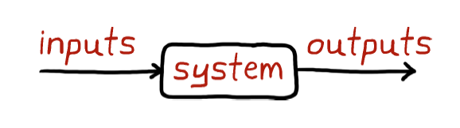

相应的，这三个变量就产生了三个问题:

#### 三个不同的问题

- The system identification problem：根据系统的输入输出，计算系统的数学模型
	- Black Box Method 你并不知道系统内部有什么细节，所以既需要决定是什么系统又需要决定参数
	- White Box Method 需要决定具体参数取值
- The simulation problem: given the input and the mathematical model of the system
- The control problem: given the mathematical model of the system and the output

#### why do we need a feedback control system?

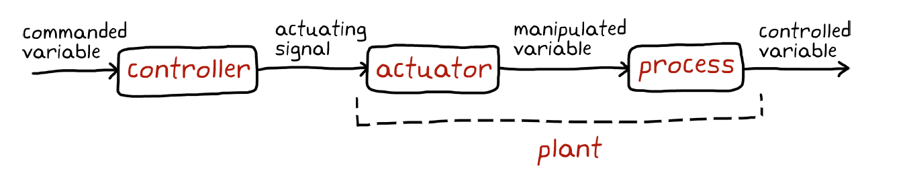

It is not sufficient enough. There may be disturbances, the process may have variations. 分别对应外界环境干扰及系统变化。

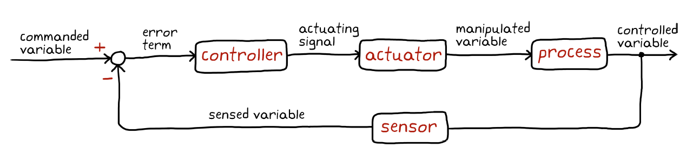

这样的系统引出了更多问题，进一步引出了稳准快三个要求，同时，传感器可能测量有偏，所以需要滤波算法。

#### what is a control system 

<u>Definition 1.1</u> A control system is a mechanism that alters the behavior (or the future state) of a system. Specifically, it should tend towards the desired states. 

### Transfer Functions 

自然而然的，我们可以将系统写成微分方程的形式，但并不利于我们的分析以及manipulation。**同时难以根据系统框图的划分以及组合对数学描述进行同样的操作。**

最常使用的两个分析方式是 状态空间表示法 以及 转移函数。我们可以大致认为转移函数是Laplace 域的表示方式并常与经典控制理论相关，而状态空间表示是时域的表示方式并常与现代控制理论相关。

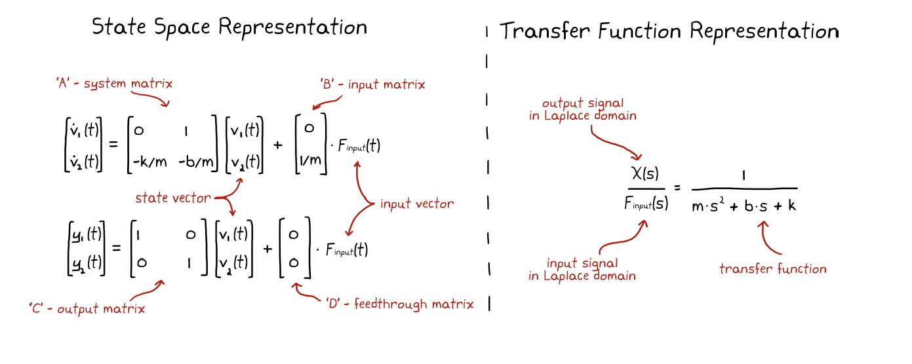

<u>Definition 2.1</u> **A transfer function** is the Laplace transform of the impulse response of a linear, time-invariant system with a single input and single output when you set the initial conditions to zero. They allow us to connect several systems in series by performing convolution through simple multiplication.

实际系统中，不光有误差而且有延迟，这些都需要被数学描述。

#### LTI systems(Linear and Time-Invariant)

首先需要思考的是，我们在控制系统中所描述的数学模型，并不如以前所学的函数一样，只接受单一时刻的输入，还有可能需要看到更之前的信息以确定$dx/dt,dx^2/dt^2$。

<u>Definition 2.2</u> 使用递归定义，若$x(t)$是一个LTI system，则...

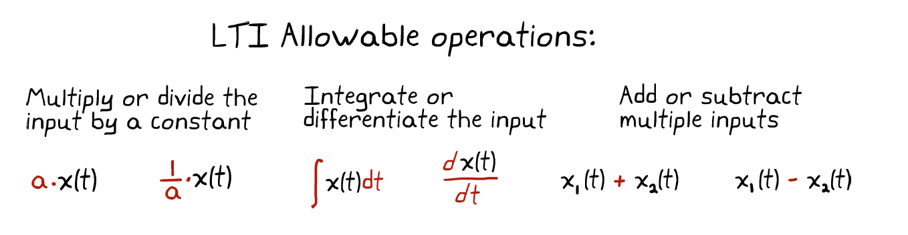

LTI system have the following properties:

- homogeneity: $ h(ax) = a\cdot h(x)$
- superposition: $ h(x_1) + h(x_2) = h(x_1+x_2)$ 
- time-invariance: $ y(t) = h(x(t)),y(t-T) = h(x(t-T))$

前两个特性，决定了我们可以给出一个通用的数学表示。

Sadly, 现实生活中几乎不存在真正的LTI系统，我们只能通过确定系统在哪些输入域上是线性的，进而给一个非线性系统列出一个线性的表示。这个过程被称为线性化。

Q: 怎么判断是不是LTI系统，时域上系统只能用微分方程描述，那能用微分方程描述的都是LTI么？

#### Impulse Function

<u>Definition 2.3</u>  The impulse function is a signal that is infinitesimally short in time but has infinite magnitude. It is also referred to as the Dirac Delta Function.

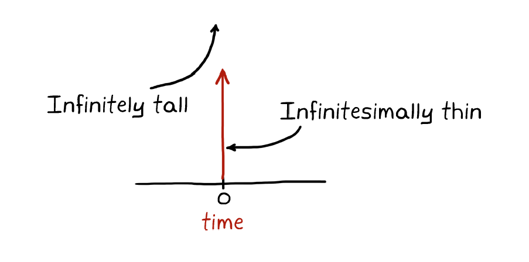

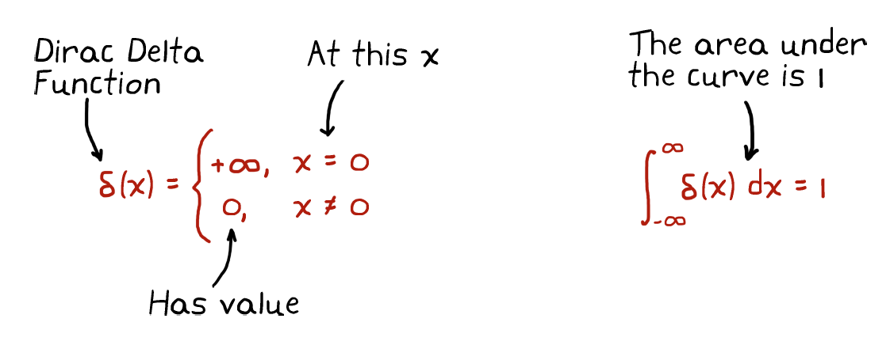

考虑到我们所研究的系统是SISO的，如果传函具有积分环节，Impulse Function就允许我们在任意的时间任意的改变输出量。

- 对于任意性质的传函，Impulse Function有怎样的意义？（与积分环节对应。）
- 实际工作中，输入不可能是Impulse Function的形式。（引出下面的卷积。）

#### Convolution Integral 

用于解决实际工程中，输入不可能是Impulse Function的问题。

> 阅读之前：
>
> <u>Definition 2.4</u> 
>
> 连续的卷积： $(f*g)(n) =\int_{-\infty}^{\infty}f(\tau)g(n-\tau)d\tau $
>
> 离散的卷积：$(f*g)(n) =\sum_{\tau=-\infty}^{\infty}f(\tau)g(n-\tau)$
>
> 可以考虑$g(t)$为在$t=0$时刻附加某个单位强度影响而产生的响应，而$f(t)$为$[-\infty,\infty]$施加影响强度的一个函数，若系统为LTI，则在时刻$n$的响应则为$(f*g)(n)$。
>
> 相应引出的问题是，$g(t)$与Impulse Function Response 有什么关系？

实际的解决方案是，若$g(t)$为Impulse Function Response，怎么修改$f(t)$使之符合目的。实际上，f(t) 就是输入的响应强度随时间的函数。

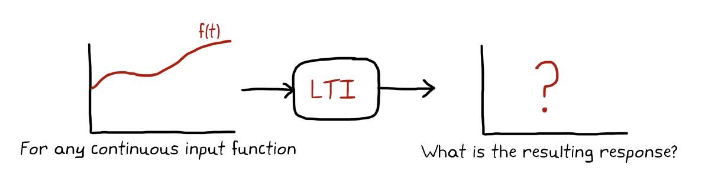

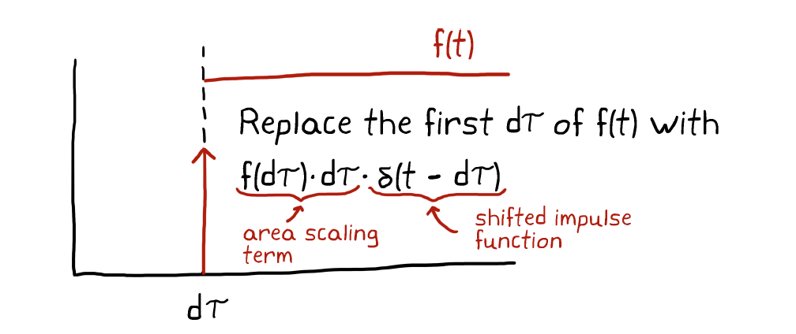

把$f(t)$ 划分成$d\tau$ 时间，对第一份时间，我们可以获得一个等效的Impulse Function，$f(d\tau)\cdot d\tau \cdot \delta(t-d\tau)$，与之对应的响应是$f(d\tau)\cdot d\tau \cdot g(t-d\tau)$。通过有限次离散，我们可以得到系统的响应为$\sum_{i=0}^{\infty}f(i\cdot d\tau)\cdot d\tau \cdot g(t-i\cdot d\tau)\longrightarrow lim_{d\tau \to 0}\longrightarrow \int_{0}^{\infty}f(\tau)g(t-\tau)d\tau$。

至此，只需LTI系统的Impulse Response，我们就可以算出任意输入下的输出。但因为卷积的计算并不轻松，同时考虑到$g()$函数是系统的性质，是不变的，想到表示计算$g()$的卷积算子。

#### The Frequency Domain and the Fourier Transform 

> The goal of this section, however, is not to fully understand the math involved in getting to and from the frequency domain but rather to provide just enough information to grasp its importance to transfer functions and to understand why the frequency domain makes our lives easier as control engineers.

In short, why the frequency domain?

- frequency domain is a different way for representing the signal 
	- Fourier Transform
	
	Q: 可以理解时域是频域的叠加，反过来不能理解。
	
	Fourier Transform 得到一个复数，通过简单的运算就能得到幅值和相位。
	
	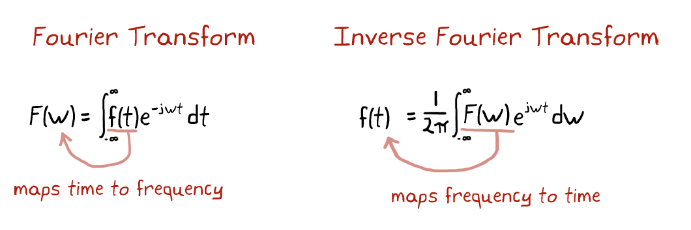
	
	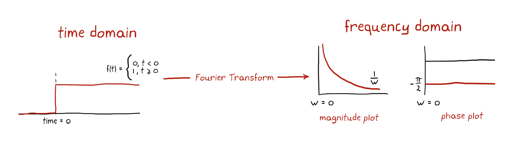
	
	Q: 怎么获得的相位与频率的关系？
	
- 主要问题是怎么表现$g()$的卷积算子

$$
\begin{eqnarray}
\mathcal{F}((f*g)(t)) &=&\int_{-\infty}^{\infty}[\int_{-\infty}^{\infty}f(\tau)g(t-\tau)d\tau]e^{-jwt}dt
\\ 
&=& \int_{-\infty}^{\infty}f(\tau)\int_{-\infty}^{\infty}g(t-\tau)e^{-jwt}\cdot e^{jw\tau} dte^{-jw\tau} d\tau
\\
&=& \int_{-\infty}^{\infty}f(\tau)e^{-jw\tau}d\tau\cdot G(w)
\\
&=& F(w)\cdot G(w)
\end{eqnarray}
$$

所以频域下，我们可以由系统的Impulse Response轻松得到任意输入的响应。

但传函并不是在频域下而是在s域下的，WHY？

#### The s domain and the Laplace Transform

> 一说，Fourier Transform 可积的条件太严苛，所以乘上一个不断衰减的信号$e^{-\sigma t}$，同时为了保证是衰减信号，限定积分域是$[0,\infty]$。

在Fourier Transform中，我们将函数分解为形如：
$$
e^{jwt}= cos(wt)+jsin(wt)\\
\mathcal{F}(f(w))=\int_{-\infty}^{\infty}f(t)e^{-jwt}dt
$$
而Laplace Transform将分解更进一步分解为形如：
$$
e^{st}=e^{(\sigma+jw)t}=e^{\sigma t}\cdot e^{jwt}\\
\mathcal{L}(f(s))=\int_0^{\infty}f(t)e^{-st}dt
$$

这两个变换本质上就是积分变换的一种，只是换了基底。

但为什么选取这两个基底，或者不再继续扩充基底？因为对于LTI系统而言，只有$e^{st}=e^{(\sigma+jw)t}$这种形式不会变形。

#### Transfer Function: An Example

Now, we are dealing with such a problem:

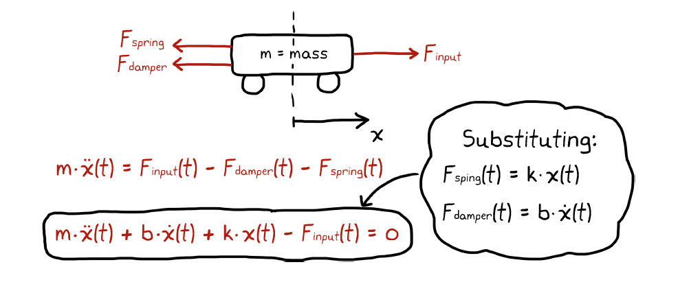

The first thing to do is calculate the transfer function, which is the Laplace transform of the according $x(t)$:

$$
m\cdot \ddot{x}(t) +b\cdot \dot{x}(t) +k\cdot x(t)-\delta(t)=0
$$

Sadly, this can be very time consuming, so we take the Laplace transform of the entire differential equations:

| $f(t)$        | $F(s)$                                   |
| ------------- | ---------------------------------------- |
| $\delta(t)$   | 1                                        |
| $x(t)$        | $X(s)$                                   |
| $\dot{x}(t)$  | $s\cdot X(s)-x(0)$                       |
| $\ddot{x}(t)$ | $s^2\cdot X(s)- s\cdot x(0) -\dot{x}(0)$ |

and we get:
$$
(m\cdot s^2+ b\cdot s+k )\cdot X(s) -1 = 0\\
X(s) =\frac {1}{m\cdot s^2 +b\cdot s+ k }
$$
What if the input is not the impulse function,but a step function $1/s$? 有两种思路都会导致同样的结果。

1.  考虑输入信号与传递函数的乘法运算（时域的卷积），结果为频域表示的乘法$X(s)/s$。
2.  考虑置一个将impulse function 转换成step function的系统于控制系统前，因为最终的结果需于前一个方法结果保持一致，所以我们知道系统的串联在频域上表现为传递函数的乘法。

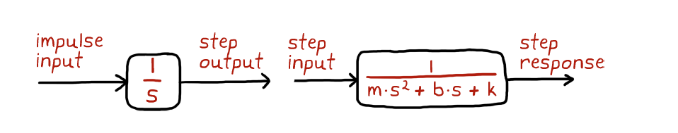

It introduces another explaination of the transfer function:

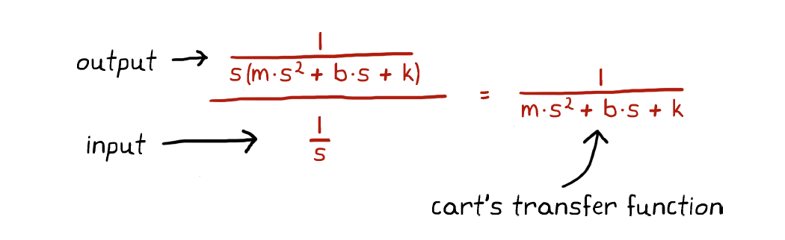

Transfer function equals to the Laplace transform of the output divides the Laplace transform of the input.

