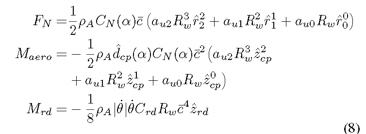

## 微型扑翼飞行器的原理

微型扑翼飞行器的原理类同于蜂鸟以及昆虫，不同于其他飞行器。其原理需要在非定常流动的低雷诺数环境中分析。

理论上或是计算上，目前都存在难度。同时，使用有限元分析软件Ansys Fluent也只能计算得到极为简化的结果（不能上控制策略，翅膀须建模为刚性翼）。

> 但是由于扑翼流场强烈的非定常特性，要找出流场准确的解析解非常困难。人们开始寻求扑翼流场的近似解。人们用基于准定常（quasi-steady）假设的简化模型来近似分析扑翼的气动力[82,83]。在准定常模型里，扑翼的运动被按时间离散成一系列静止的姿态，在每一时刻，假定扑翼该时刻的瞬时气动力等于定常情况下相同姿态的静止机翼产生的气动力，最后把计算得到各时刻气动力按时间积分就认为是扑翼气动力的变化情况。这种把非定常的流场离散成一个个连续的定常流场来计算的方法没有考虑流场的非定常影响，而这恰恰是扑翼流场最重要的部分，绝对不能忽略。

 附件一 仿鸟微型扑翼飞行器的气动特性研究 曾锐

>仿生扑翼飞行器主要面临高效飞行、高抗风、高智能化控制3 大核心难题，具体体现在：
>
>（1）缺乏完善的仿生飞行数值仿真设计分析和试验手段，尚无法全面准确揭示仿生扑翼飞行机理及其与结构参数的关系。仿生飞行器的雷诺数低，存在层流和湍流共存的复杂流动现象，飞行器的升阻特性变化剧烈，常规的计算方法误差很大；仿生翼在飞行过程中相对大变形和气动力相互影响，这种气动/ 结构的强耦合给数值仿真计算带来很大难度；由于低雷诺数效应，仿生微型飞行器的风洞试验对流场品质要求极高，只有低速、超低湍流度风洞才能保证试验精度；仿生飞行器飞行时有固有的俯仰、沉浮等组合运动形式，传统的固连式支架系统难以模拟这种实际飞行状况；仿生柔性翼的气动特性和柔性变形息息相关，需要在风洞试验中同时测量气动力和对应的柔性变形才能分析出仿生机理，国际上的此类研究较少。因此亟须建立一套完善的数值仿真与试验研究系统，
>来研究鸟类是如何产生和利用非定常流和旋涡来获得高升力和大推力，并建立仿鸟扑翼飞行器低雷诺数非定常气动数值模拟与试验研究方法，为仿生扑翼飞行器的设计提供支撑。

附录二  

## 固定翼，旋翼微型化的问题

固定翼以及旋翼在低雷诺数下都会显著恶化。

> 微型固定翼飞行器由于主尺度较小， 飞行速度较低， 相应的雷诺数（ Reynolds number—Re）数范围大约在104～105 之间，进一步微型化后，Re 数可能会降到102 左右。低Re 数下，空气黏性效应显著，气动力出现一些与高Re 数下显著不同的特性。绕机翼流动边界层首先会出现层流分离，失稳后转变为湍流，再附于物面，形成一个层流分离泡（laminar separation bubble），使机翼气动特性变坏，出现阻力增大，升阻比下降，升力系数随攻角呈现非线性变化，有时升力、阻力和力矩都会产生“滞回”（hysteresis）现象。
> 对于低Re 数下流动特性的这种复杂变化，至今还没有完全认识清楚，例如翼剖面上长、短分离泡的形成过程。试验中发现有时长泡出现后，会跟随产生一个短泡，但有些条件下情况却恰恰相反。初步分析，这种现象的产生与来流速度、攻角、弦长和剖面厚度等参数有关，但其影响的大小和作用机理需要进一步的研究。

> 旋翼微飞行器是在极低的雷诺数下飞行的，因此空气的黏性作用力较大，其空气动力学特性与常规的旋翼直升机有较大的差异，直升机的空气动力学原理不能直接应用于旋翼微飞行器。微型直升机常用的分析方法是叶素法，叶素是一小段桨叶，叶素法的原理是先将桨叶个剖面看做一个翼型，然后计算该剖面翼型所受的空气动力，最后把桨叶各叶素的拉力和气动扭距从叶根至叶尖积分，再乘以桨叶数目即可得旋翼的总拉力和总气动扭距。在大型直升机的叶素法中，通常在计算升力和诱导角时为了计算的方便而忽略了因诱导效应引起的水平诱导速度的影响。这在高雷诺数的计算中是完全可行的。因为高雷诺数的黏性力小，水平诱导速度主要由诱导效应产生，诱导速度的大小与旋转速度相比非常小，因此它对升力和诱导角的影响可以忽略不计。然而在低雷诺数下微型旋翼飞行器的计算中，每片桨叶所受的粘性力对微飞行器升力的影响比较显著，为了提高计算准确性，叶素法需要重新加以修正。

附录三 仿生微型飞行器若干关键问题的研究 左德参 

## 开源的动态仿真环境

Purdue 大学的Xinyan Deng组确实有类似的仿真工作, 并且我们的飞行器设计也是基本借鉴他们的工作。（附录四）

 计算升力使用叶素法，简化系统为刚性翼及准定常系统

虽然采用了较强的简化，但实验结果较好。

### cons

该简化确实太强了，并且该文章发的层次并不高，引用量也多是自引，我有一定程度的质疑该工作。

并且这里需要实物进行system identification，以进一步计算升力，及相关参数。

> Since the mass property of the robot is largely constant and can be easily measured, the system identification process focuses more on accurate force generation. We use an ATI Nano 17 sensor to measure the cycle-averaged force generated by the robot under different operating points. A total of 37 different inputs were used and 6 body force and torque were measured at each operating point. This force map with 222 data points will be used as the ground truth to measure the accurateness of the force generation of the simulation. The cost is defined as the squared error sum between the measured force and the force calculation from simulation across all data points. The parameters were optimized with 200 individuals for 200 generations. The result with the best 
> fit is shown in Fig. 5. The simulated force map matches the measurement well, with minor errors under larger inputs. This could be caused by the nonlinearity of the spring at a large deviation angle. The total error is 4.1%.

## conclusion

基于此，我并不认为开发一个相应的仿真环境的优先级较高，且我们并不具有相适宜的能力去开发这样一个系统。

主要原因有:

- 理论及计算仿真方法都存在原理上的巨大gap
- Top组多是先建立实物而后进行system identification，少有以仿真指导实物
- Purdue 大学的工作并不令人满意，并且作为开创性工作也没有引人效仿，同时也不具备指导实物设计的能力
