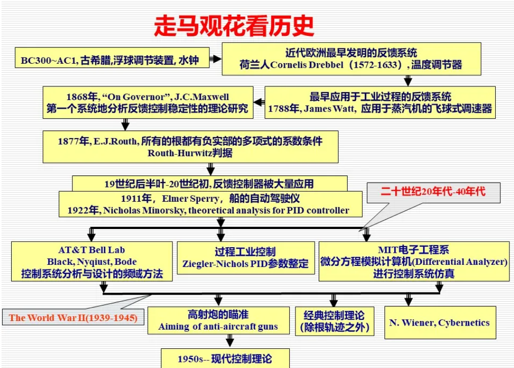
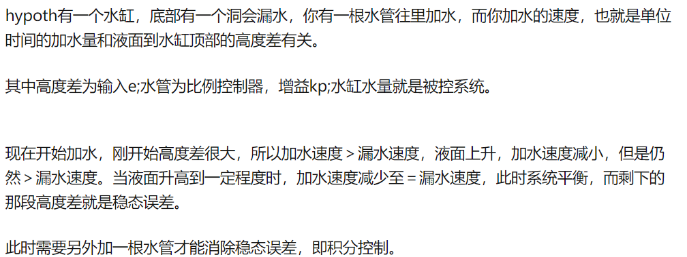
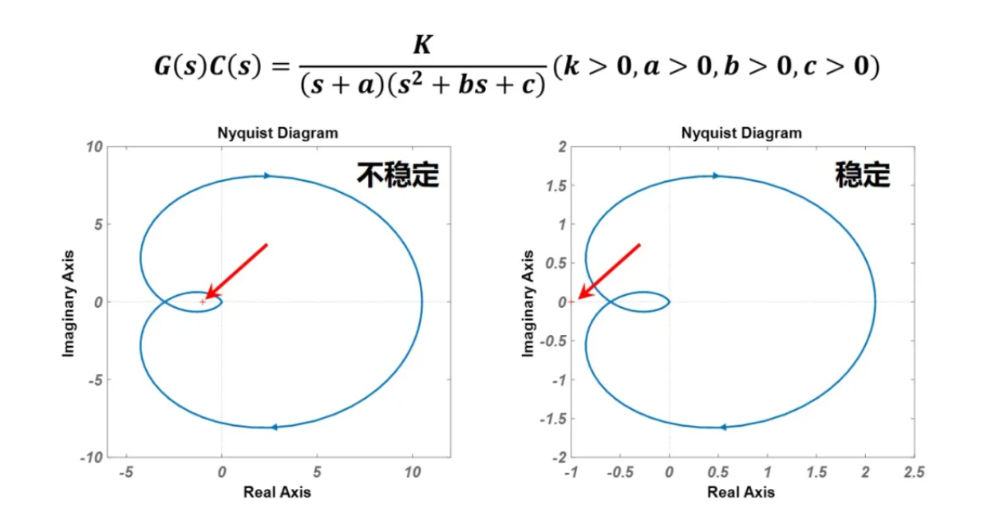
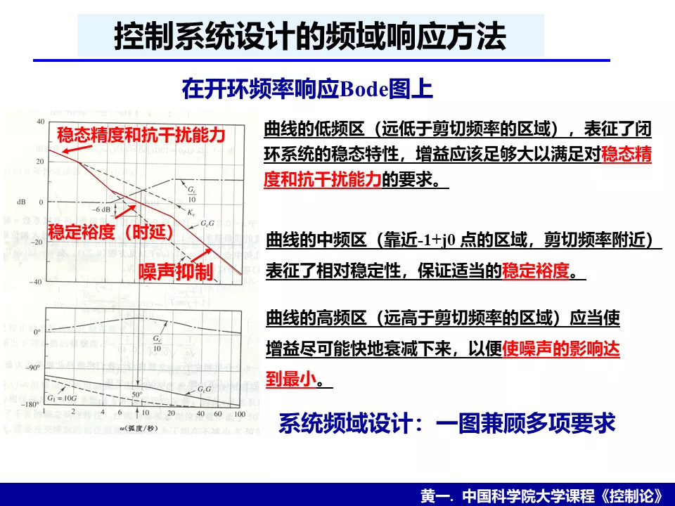
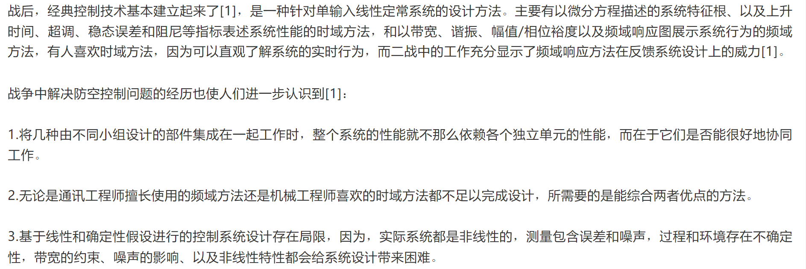

> 先见森林，再见树木。

https://mp.weixin.qq.com/s/D2SPfq-4ay4kvWYajGnXOw

https://mp.weixin.qq.com/s/tEBpf7kuORt8SP6rqqC95g

最初的控制问题关注怎样感知，以飞球式调速器为例。

能够获得速度以后的问题是怎样准确的控制速度，瓦特调速器使用了比例控制$ M d^2x/dt^2 = -F(dx/dt-V)+P-R$， $P$为驱动力矩，$R$为负载力矩，$V$为设定转速，$dx/dt$为实际转速，$F$为反馈增益系数。稳态时的速度为$dx/dt = V+ (P-R)/F$。显然该系统受到负载R（未知干扰）有关的稳态偏差。

> 比例控制不能解决未知干扰项。
>
> 

19世纪最初的70年，工作focus在怎么解决稳态偏差，而解决之后，出现了稳定性的问题（hunting， 来回摆动，即不稳定）。人们开始分析*动态特性*，寻找稳定（non-hunting）的条件。

G.B.Airy （1801–1892，剑桥大学数学及天文学教授）不稳定现象，并提示不稳定问题可以通过系统的微分方程模型来说明。

> 人们对宇宙的探索对控制理论的发展起过很大的推动作用，甚至早于牛顿运动定律发表之前，天文学家是第一批着手解决动态系统稳定性问题的人，因为他们需要精确控制大型望远镜的运动而且他们熟悉太阳系中天体运动的稳定性问题。

1868年，J.C.Maxwell（James Clerk Maxwell ，1831-1879）发表论文"On Governor"，系统地分析了几类调速器并给出了稳定性条件。

Fuller认为麦克斯韦这篇论文的主要贡献是:

1. 是系统地研究动态控制系统的第一篇论文；
2. 采用了线性化技术研究运动系统的稳定性，从而通过特征方程判断系统的稳定性, 得到了三阶系统特征方程稳定的判据；
3. 文中例子说明可以设计控制器即消除偏差又不致引起不稳定；
4. 提出了寻找高阶系统稳定性判据的问题。

1877年，E.J.Routh得到特征方程所有根都有负实部的多项式系数条件，Adolf Hurwitz（1859-1919， German （Swiss） mathematician ） 1895年也独立地推出了这个判据，因而并称Routh-Hurwitz判据。

19世纪后半叶-20世纪初, 反馈控制器被大量应用，1911年，Elmer Sperry发明带有PID控制的船的自动驾驶仪，1922年,Nicholas Minorsky通过分析船的自动驾驶问题, 推导出了我们现在称为的三项控制器---PID（Position-Integral-Derivative）控制器形式。

截至到目前,控制设计的问题开始变得突出:

1. 缺乏通用语言来从理论上理解动态系统的控制问题.
2. 缺乏简单的、容易运用的分析与设计方法。唯一可用的分析工具为微分方程以及尚未广为人知的Routh-Hurwitz 稳定性判据.

1927年，Black（Harold Stephen Black，1898-1983，American electrical engineer）正式发明了负反馈放大器，提出了负反馈概念，但又一次引出了系统稳定性的问题，因为系统动态特性较复杂，逐渐发展出频率响应及复变函数理论以对控制系统分析及设计。

H. Nyquist，在频域上建立出一个与已有工作完全不同的稳定性判据-Nyquist判据。

H.Bode 提出了利用频域的Bode图、幅值裕度/相位裕度等相对稳定性概念来设计负反馈放大器，并指出了系统增益与带宽的极限关系。该分析方法不仅考虑到了控制系统的稳定性，同时顾及了快速性，准确性，抗扰性等指标。

同时期的其他学术群体，分别提出了PI及PID控制的参数整定法，称为Ziegler-Nichols调整法，以及设计了微分方程模拟计算机，以便进行控制系统仿真。

世界第二次大战进一步促进了控制的发展。

Bellman的动态规划、Pontryagin的极大值原理和Kalman滤波被认为是现代控制理论的三个代表性工作。

> 1948年-1952年，Bellman（Richard Bellman，1920-1984）在兰德公司（Rand Corporation）数学部工作，他在研究解决导弹部署以达到最大破坏力问题的过程中，提出了“最优性原理（principle of optimality）”和“动态规划（dynamic programming）”[1]。
>
> Pontryagin（Lev Semenovich Pontryagin，1908-1988）是苏联数学家，航天飞行任务除了落点精度的要求外，系统性能还涉及一些其他限制: 如时间最短或燃料消耗最少等，Pontryagin 1956年提出的极大值原理是关于这类最优控制问题的理论基础[1]。
>
> Kalman滤波则是从带有噪声以及不完全测量的信号中提取所需信号的一种数学算法，Kalman滤波刚提出时曾受到很大质疑，直到1960年，Kalman（Rudolf Emil Kalman，1930-2016）访问NASA Ames研究中心，其后Kalman滤波成功地在阿波罗登月计划中得以应用。

